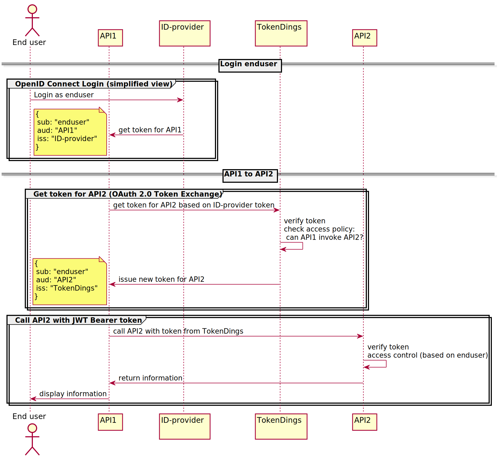

# TokenDings

**TokenDings** is an OAuth 2.0 Authorization server that provides applications with security tokens in order to securely communicate with eachother in a **zero trust** architecture - to the extent that  traditional boundaries such as **security zones** and **security gateways** can be made obsolete. 

It will ensure that the original caller/subject identity is propagated while still maintaining app to app security. TokenDings is an add-on to the *zero trust networking* principles (with components such as **Istio**), focusing on the application layer, making your applications truly capable of maintaining the *zero trust* paradigm. 

TokenDings is a microservice implementing parts of the [OAuth 2.0 Token Exchange](https://www.rfc-editor.org/rfc/rfc8693.html) specification:

>This specification defines a protocol for an HTTP- and JSON-based Security Token Service (STS) by defining how to request and obtain security tokens from OAuth 2.0 authorization servers, including security tokens employing impersonation and delegation.

The application has been named **TokenDings** in order to avoid confusion with other "Security Token Services" (STS) currently deployed in our environment. 

In essence the motivation behind creating this application is based on the lack of offerings in the market implementing 
the functionality needed for "enduser" centric access control while using properly "scoped" OAuth 2.0 access_tokens (JWTs) in Web API chains (the exception being the proprietary OBO flow from Azure AD).

This is best described by an example:
* End user log in to API1 (and get a token intended for API1)
* API1 will invoke a downstream api - API2 - to retrieve information
* API2 will enforce access control based on the enduser

In the above mentioned example API1 will have to invoke API2 on-behalf-of the enduser. 
When using OAuth 2.0 JWT Bearer tokens this entails getting a correctly scoped token 
(i.e intended for each "hop" in a downstream chain) while still keeping the authenticated end user as the subject. 



Other relevant specifications implemented:

* [OAuth 2.0 Authorization Server Metadata](https://www.rfc-editor.org/rfc/rfc8414.html): for configuring an app (OAuth2 Client) using TokenDings
* [OAuth 2.0 Dynamic Client Registration Protocol](https://tools.ietf.org/html/rfc7591): for registering apps (OAuth2 Clients) and access policies

## Usage

TokenDings provide a [OAuth 2.0 Authorization Server Metadata](https://www.rfc-editor.org/rfc/rfc8414.html) endpoint, e.g. https://tokendings.prod-gcp.nais.io/.well-known/oauth-authorization-server, which can be used to configure your application with metadata about the OAuth 2.0 authorization server, such as the token endpoint to call.

Your application can take the token received from your identity provider and exchange it with a "properly scoped" token from TokenDings (i.e. a token intended for the app you are about to invoke). In order to do that you will have to send a token request to TokenDings containing the token you want to exchange. The following HTTP snippet shows an example:

```http
POST /token HTTP/1.1
Host: tokendings.prod-gcp.nais.io
Content-Type: application/x-www-form-urlencoded

grant_type=urn:ietf:params:oauth:grant-type:token-exchange&
client_assertion_type=urn:ietf:params:oauth:client-assertion-type:jwt-bearer&
client_assertion=eY...............&
subject_token_type=urn:ietf:params:oauth:token-type:jwt&
subject_token=eY...............&
audience=prod-fss:namespace1:app1
```

| Parameter               | Value                                                    | Comment                                                      |
| ----------------------- | -------------------------------------------------------- | ------------------------------------------------------------ |
| `grant_type`            | `urn:ietf:params:oauth:grant-type:token-exchange`        | The identifier of the OAuth 2.0 grant to use, in this case the OAuth 2.0 Token Exchange grant. This grants allows applications to exchange one token for a new one containing much of the same information while still being correctly "scoped" in terms of OAuth. |
| `client_assertion_type` | `urn:ietf:params:oauth:client-assertion-type:jwt-bearer` | Identifies the type of *assertion* the client/application will use to authenticate itself to TokenDings, in this case a JWT. |
| `client_assertion`      | A serialized JWT identifying the calling app             | A JWT signed by the calling client/application, identifying itself to TokenDings. |
| `subject_token_type`    | `urn:ietf:params:oauth:token-type:jwt`                   | Identifies the type of token that will be exchanged with a new one, in this case a JWT |
| `subject_token`         | A serialized JWT, the token that should be exchanged     | The actual token (JWT) containing the signed-in user         |
| `audience`              | The identifier of the app you wish to use the token for  | Identifies the intended audience for the resulting token, i.e. the target app you request a token for. |

### Creating a client_assertion

The `client_assertion` is a JWT signed by the application making the token request. The public key of the keypair used for signing the JWT and the `client_id` of the application must be preregistered in TokenDings. 

For applications in nais clusters, the client registration will be handled automatically when applying the application spec (handled by the k8s operator [Jwker](https://github.com/nais/jwker/)). The respective key pair will be made available as a k8s secret. This secret must be used to sign the `client_assertion`.

The `client_assertion` must contain the following claims:

* the claims `sub` and `iss` should both be equal and identify the calling client/app to TokenDings, i.e. your apps preregistered `client_id`
* the `aud` claim should contain the intended "audience" for the token, i.e. it should be equal to the token endpoint you are about to call, for example:`https://tokendings.prod-gcp.nais.io/token`
* a unique JWT id should be provided in the claim `jti`
* Expiration claims such as `nbf`, `iat` and `exp` must be present and the **maximum lifetime** of the token cannot be more than **120** seconds

The following example shows all the required claims of a client_assertion JWT:

*Header*

```json
{
  "kid": "93ad09a5-70bc-4858-bd26-5ff4a0c5f73f",
  "typ": "JWT",
  "alg": "RS256"
}
```

*Payload*

```json
{
  "sub": "prod-gcp:namespace-gcp:gcp-app",
  "aud": "https://tokendings.prod-gcp.nais.io/token",
  "nbf": 1592508050,
  "iss": "prod-gcp:namespace-gcp:gcp-app",
  "exp": 1592508171,
  "iat": 1592508050,
  "jti": "fd9717d3-6889-4b22-89b8-2626332abf14"
}
```

Check out this diagram for information about the inner workings of TokenDings from the application usage perspective: [Application Usage](doc/application_usage.svg)

## Client Registration
All applications using TokenDings must be preregistered as authorized OAuth 2.0 clients in order to exchange tokens. 
A client registration can only be sent from a trusted party, such as e.g. the k8s operator [Jwker](https://github.com/nais/jwker/).

TokenDings implements parts of the [OAuth 2.0 Dynamic Client Registration Protocol](https://tools.ietf.org/html/rfc7591) for handling client registrations. 
The API for client registration requires a JWT bearer token from Azure AD and a signed "software statement" about the client containing:
* Public keys (`JWKS`) of the keypair that the client will use for signing a `client_assertion`
* Access policy containing which apps can request a token for this client
* A unique `client_id` for this client

For more details about the client registration process see this diagram [Client Registration](doc/client_registration.svg)

## Upgrading the gradle wrapper
Find the newest version of gradle here: https://gradle.org/releases/
Then run this command:
```./gradlew wrapper --gradle-version $gradleVersion```


## 👥 Contact

This project is currently maintained by the organisation [@navikt](https://github.com/navikt).

If you need to raise an issue or question about this library, please create an issue here and tag it with the appropriate label.

If you need to contact anyone directly, please see contributors.

## ✏️ Contributing

To get started, please fork the repo and checkout a new branch. You can then build the library locally with the Gradle wrapper

```shell script
./gradlew build
```

See more info in [CONTRIBUTING.md](CONTRIBUTING.md)

## ⚖️ License
This library is licensed under the [MIT License](LICENSE)
